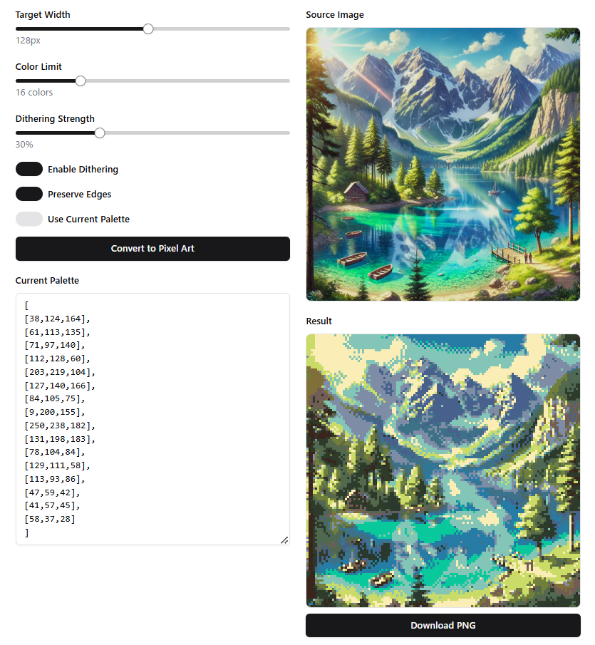

# PicPixeller ([Demo](https://abagames.github.io/pic-pixeller/index.html))

A web-based tool that transforms regular images into pixel art with customizable settings.

## Key Features

### Image Processing

- Convert any image into authentic pixel art style
- Adjustable target width (8-256 pixels) for precise scaling
- Intelligent edge preservation to maintain image clarity
- Automatic color palette generation
- Support for custom color palettes

### Color Management

- Adjustable color limit (2-64 colors)
- Smart color quantization for optimal results
- Custom palette support with RGB value input
- Automatic palette generation based on image colors

### Advanced Effects

- Adjustable dithering strength (0-100%)
- Edge preservation toggle for detail control
- Floyd-Steinberg dithering algorithm for smooth color transitions
- Transparent background support

## How to Use

1. **Upload an Image**

   - Drag and drop any image file onto the upload area
   - Supported formats include PNG, JPG, and other common image formats

2. **Adjust Settings**

   - Target Width: Set the desired width of your pixel art
   - Color Limit: Choose how many colors to use in the final image
   - Dithering: Enable/disable and adjust dithering strength
   - Edge Preservation: Toggle edge detection for clearer details

3. **Custom Palette (Optional)**

   - Enable "Use Current Palette" to work with custom colors
   - Input RGB values in the palette text area
   - Format: `[[R, G, B], [R, G, B], ...]` where R, G, B are values from 0 to 255

4. **Export**
   - Click "Download PNG" to save your pixel art
   - The exported image maintains transparency if present

## Technical Details

The converter uses advanced image processing techniques including:

- Floyd-Steinberg dithering for color reduction
- Edge detection algorithms for detail preservation
- Intelligent color palette generation using color space analysis
- Perceptual color distance calculations for accurate color matching

## Best Practices

- Experiment with different target widths to find the ideal pixel size
- Use edge preservation for images with important details
- Adjust dithering strength based on the desired aesthetic
- Consider using custom palettes for consistent style across multiple images

This tool is ideal for:

- Game developers creating pixel art assets
- Artists working on retro-style illustrations
- Designers creating pixel art icons or logos
- Anyone interested in converting images to pixel art style
